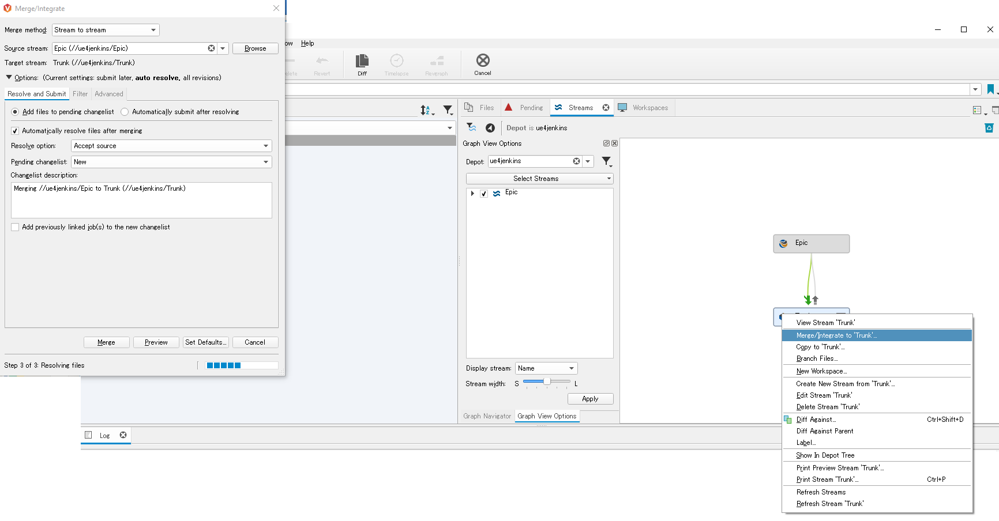

# Setup

This document describe steps to have the engine, perforce and jenkins setup in order to run the jenkins pipelines of this project.

## Preparation

You will need a lot of disk space during that setup, at least 10GB. (Without taking into account space on the perforce server)
// TODO : update disk space taken by jenkins setup

Setup a github account in order to be able to download a version of UE4:
https://github.com/EpicGames/UnrealEngine

Select the version of the engine you want to use and download the zip

Unzip to your harddrive.

Run Setup.bat (This will download around 5GB of additional data)

## UE4 perforce setup

See Epic documentation about setting up perforce
https://docs.unrealengine.com/en-us/Engine/Basics/SourceControl/Perforce

This project will use perforce streams to manage the merge. But the same result can be implemented using branches.

I recommend to create a specific user that only jenkins will use (As this user will have some special rights).

It is really important to properly setup the perforce "typemap" before starting
to add any files to perforce.

I also have a slighty different setup than the one describe in Epic documentation.

You will need a perforce account with "Permission Level / Right" of level "admin"

    p4 -P YourPassword typemap

    binary+w //ue4jenkins/....exe
    binary+w //ue4jenkins/....dll
    binary+w //ue4jenkins/....lib
    binary+w //ue4jenkins/....app
    binary+w //ue4jenkins/....dylib
    binary+w //ue4jenkins/....stub
    binary+w //ue4jenkins/....ipa
    binary //ue4jenkins/....bmp
    text //ue4jenkins/....ini
    text //ue4jenkins/....config
    text //ue4jenkins/....cpp
    text //ue4jenkins/....h
    text //ue4jenkins/....c
    text //ue4jenkins/....cs
    text //ue4jenkins/....m
    text //ue4jenkins/....mm
    text //ue4jenkins/....py

Note that I added the following types compare to Epic recommended setup:

    binary+l //ue4jenkins/....uasset
    binary+l //ue4jenkins/....umap
    binary+l //ue4jenkins/....upk
    binary+l //ue4jenkins/....udk
    binary+w //ue4jenkins/....pdb
    binary+w //ue4jenkins/....so
    text //ue4jenkins/....target
    text //ue4jenkins/....modules
    text //ue4jenkins/....exe.config
    text //ue4jenkins/....target.xml
    text //ue4jenkins/....uplugin
    text //ue4jenkins/....uproject
    text //ue4jenkins/....xml
    binary //ue4jenkins/....png

This command will not work properly with some text editor (for example Notepad++). In that case you need to change the text editor used by p4 commands using the following command:

    p4 set P4EDITOR=C:\Windows\system32\notepad.exe

You can change the file type of files afterward using the command

    p4 edit -t text+w ....modules

The command above will change all .modules files in current folder and all sub folders to type "text+w"

## UE4 perforce streams setup

The UE4 engine and UE4 projects will use the following setup:

"//ue4jenkins/Epic" stream
- Contains unmodified UE4 downloaded from Epic (Github or perforce)
- This stream will be updated with each major and minor version of UE4
- This will allow to merge the engine inside your perforce setup
- This will also help your team to compare the default engine with your modified version
- Only the jenkins user should have write access to this stream.

"//ue4jenkins/Trunk" stream	
- Contains the modified UE4 which you use for your project(s)

"//ue4jenkins/Branches/4.XX" stream	
- Branches for merging new Epic version into your modified engine

"//ue4jenkins/Project_A" stream
- One of the project using the UE4 in the Trunk stream
- Note that you could also directly add your project inside the trunk stream.

## Upload UE4 to perforce

When adding the engine to perforce, you will have a window "Add these files with wildcards" click OK

You can also not add files related to git
- ".editorconfig"
- ".gitattributes"
- ".gitignore"
- ".tgitconfig"

Next step is to merge from "Epic" stream to the "Trunk" stream

## UE4 compilation and upload Binaries to perforce

In Visual Studio, compile "Development editor - Win64"
- Add new files in Engine/Binaries/Win64 to perforce

- Add new files in Engine/Plugins/.../Binaries/Win64 to perforce

In P4V, you can right click the Engine/Plugins folder and click "Open command window here"
then use the following commands:

    p4 add ....modules
    p4 add ....pdb
    p4 add ....dll

## UE4 game compilation and upload to perforce

After downloading the engine from perforce, each member of the team will need to register the engine.

This is automaticly done with the "Setup.bat" present in UE4 but can also be called manually:

    .\Engine\Binaries\Win64\UnrealVersionSelector-Win64-Shipping.exe /register

After the engine is registered, and the project created, you can right click on the uproject file and select "Generate Visual Studio project files"

